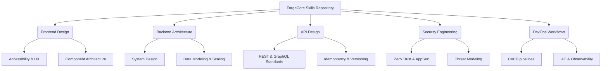

# ⚒️ ForgeCore Skills

**Production-grade AI Agent Skills, Workflows, Templates, and Best Practices for building exceptional software.**

*Stop generating boilerplate. Start engineering systems.*

---

## 📖 Overview

ForgeCore Skills is not a collection of tutorials or basic code snippets. It is a distilled knowledge base of senior engineering practices, designed specifically to guide both human engineers and advanced AI agents in creating production-ready software.

Our mission is to elevate AI-assisted development from generating generic, unmaintainable code to designing robust architectures, accessible interfaces, and secure systems.

## 🧠 The ForgeCore Philosophy

We believe that exceptional software is built on a foundation of timeless principles, not fleeting framework trends.

1. **Architecture First:** Build systems, not just features.
2. **Quality over Quantity:** A single, well-reasoned component is better than a dozen generic ones.
3. **Assume Production:** Every line of code, every API design, and every deployment script must be treated as mission-critical.
4. **Holistic Engineering:** Security, performance, and accessibility are architectural requirements, not afterthoughts.
5. **Synthesize, Don't Summarize:** This repository contains extracted wisdom and decision frameworks, not regurgitated documentation.

---

## 🗺️ Repository Architecture

The knowledge base is organized into distinct engineering domains, each containing deep dives into best practices and operational standards.

### 📁 Skill Directories

*   [`/skills/frontend-design`](skills/frontend-design/SKILL.md) - Principles for UI/UX, accessibility (WCAG), responsive design, and robust frontend architecture.
*   [`/skills/backend-architecture`](skills/backend-architecture/SKILL.md) - System design, data modeling, scaling strategies, and managing state and technical debt.
*   [`/skills/api-design`](skills/api-design/SKILL.md) - Contracts for REST and GraphQL, idempotency, rate limiting, and API security.
*   [`/skills/security-engineering`](skills/security-engineering/SKILL.md) - Threat modeling, Application Security (AppSec), defense in depth, and incident readiness.
*   [`/skills/devops-workflows`](skills/devops-workflows/SKILL.md) - CI/CD pipelines, Infrastructure as Code (IaC), deployment strategies, and observability.

---

## 🚀 Getting Started

### For Human Engineers

Use this repository as your master execution protocol. Before starting a new project, designing a feature, or conducting a code review, consult the relevant `SKILL.md` to align your approach with production-grade standards.

### For AI Agents

If you are an AI assistant interacting with a user's codebase, you **must** read `AGENTS.md` first. It contains your operating manual, defining the behavioral constraints and engineering standards you are expected to uphold when contributing to or utilizing this knowledge base.

---

## 🤝 Contributing

We welcome contributions from senior engineers who want to share their distilled wisdom.

1. **Read the Guidelines:** Review [`CONTRIBUTING.md`](CONTRIBUTING.md) and [`AGENTS.md`](AGENTS.md) to understand our standards.
2. **Focus on Principles:** Contributions should add architectural value, not simple how-tos.
3. **One Skill per Folder:** Keep knowledge organized and focused.
4. **Submit a PR:** Explain the "why" behind your proposed changes.

## 🛣️ Roadmap

Curious about what's next? Check out our [`ROADMAP.md`](ROADMAP.md) for upcoming domains we plan to explore, including advanced AI workflows, browser automation, and specialized design systems.

---

  <i>Built with discipline. Designed for maintenance. Engineered for production.</i>

