# ⚒️ ForgeCore Skills

**The Ultimate Engineering Knowledge Base for AI Agents & Software Architects.**

*Stop generating boilerplate. Start engineering systems.*

---

[Overview](#-overview) •
[Philosophy](#-the-forgecore-philosophy) •
[Architecture Map](#️-repository-architecture) •
[Skill Domains](#-skill-domains) •
[Getting Started](#-getting-started) •
[Contributing](#-contributing)

## 📖 Overview

**ForgeCore Skills** is not a collection of tutorials or basic code snippets. It is a highly curated, distilled knowledge base of senior engineering practices. It is designed specifically to guide both human engineers and advanced AI agents in designing and creating production-ready software.

Our mission is to elevate AI-assisted development from generating generic, unmaintainable code to designing robust architectures, accessible interfaces, and secure systems.

## 🧠 The ForgeCore Philosophy

We believe that exceptional software is built on a foundation of timeless principles, not fleeting framework trends.

| Principle | Description |
| :--- | :--- |
| 🏛️ **Architecture First** | Build systems, not just features. Design for scalability and maintainability. |
| 💎 **Quality > Quantity** | A single, well-reasoned component is vastly superior to a dozen generic ones. |
| 🚀 **Assume Production** | Every line of code, API design, and deployment script must be mission-critical. |
| 🛡️ **Holistic Engineering** | Security, performance, and accessibility are architectural requirements, not afterthoughts. |
| 🧪 **Synthesize Knowledge** | We extract wisdom and build decision frameworks, avoiding regurgitated documentation. |

---

## 🗺️ Repository Architecture

The knowledge base is organized into distinct engineering domains, each containing deep dives into best practices and operational standards.

```mermaid
graph TD
    A[ForgeCore Skills Repository] --> B(Frontend & UI)
    A --> C(Backend & APIs)
    A --> D(Data & Cloud)
    A --> E(DevOps & SRE)

    %% Frontend & UI
    B --> B1[Frontend Design]
    B --> B2[UI Templates]
    B --> B3[Cross-Platform]
    B --> B4[Media Management]

    %% Backend & APIs
    C --> C1[Backend Architecture]
    C --> C2[API Design]
    C --> C3[Microservices]
    C --> C4[Fullstack Architecture]

    %% Data & Cloud
    D --> D1[Database Engineering]
    D --> D2[Data Engineering]
    D --> D3[Cloud Architecture]
    D --> D4[Security Engineering]

    %% DevOps & SRE
    E --> E1[DevOps Workflows]
    E --> E2[Testing Strategies]
    E --> E3[Site Reliability Engineering]
    E --> E4[AI Workflows]
```

---

## 📚 Skill Domains

Explore our comprehensive library of distilled engineering knowledge.

### 🎨 Frontend & Design Systems
*   [`/skills/frontend-design`](skills/frontend-design/SKILL.md) - UI/UX, accessibility (WCAG), responsive design, and frontend architecture.
*   [`/skills/ui-templates-and-design`](skills/ui-templates-and-design/SKILL.md) - Visual hierarchies, layout patterns, and reusable UI templates.
*   [`/skills/cross-platform-architecture`](skills/cross-platform-architecture/SKILL.md) - PWAs, React Native, and cross-platform design systems.
*   [`/skills/media-management`](skills/media-management/SKILL.md) - Image/video optimization, CDNs, and media retrieval.

### ⚙️ Backend & Systems Architecture
*   [`/skills/backend-architecture`](skills/backend-architecture/SKILL.md) - System design, data modeling, scaling strategies, and technical debt.
*   [`/skills/api-design`](skills/api-design/SKILL.md) - Contracts for REST and GraphQL, idempotency, rate limiting, and API security.
*   [`/skills/fullstack-architecture`](skills/fullstack-architecture/SKILL.md) - Application design, SSR/CSR/SSG, and the BFF pattern.
*   [`/skills/microservices-architecture`](skills/microservices-architecture/SKILL.md) - Distributed systems, bounded contexts, and saga patterns.

### 💾 Data & Cloud Infrastructure
*   [`/skills/database-engineering`](skills/database-engineering/SKILL.md) - Schema design, indexing strategies, query optimization, and transactions.
*   [`/skills/data-engineering`](skills/data-engineering/SKILL.md) - Data pipelines, data warehousing, and ETL/ELT architecture.
*   [`/skills/cloud-architecture`](skills/cloud-architecture/SKILL.md) - Cloud-native design, serverless, edge computing, and FinOps.
*   [`/skills/security-engineering`](skills/security-engineering/SKILL.md) - Threat modeling, AppSec, defense in depth, and incident readiness.

### 🛠️ DevOps, Reliability & AI
*   [`/skills/devops-workflows`](skills/devops-workflows/SKILL.md) - CI/CD pipelines, Infrastructure as Code (IaC), and deployment strategies.
*   [`/skills/site-reliability-engineering`](skills/site-reliability-engineering/SKILL.md) - SLAs/SLOs, incident command, and chaos engineering.
*   [`/skills/testing-strategies`](skills/testing-strategies/SKILL.md) - Automated testing, TDD/BDD, test pyramids, and mocking.
*   [`/skills/ai-workflows`](skills/ai-workflows/SKILL.md) - AI agent patterns, RAG architecture, prompt engineering, and LLM orchestration.

---

## 🚀 Getting Started

### 👨‍💻 For Human Engineers
Use this repository as your master execution protocol. Before starting a new project, designing a feature, or conducting a code review, consult the relevant `SKILL.md` to align your approach with production-grade standards.

### 🤖 For AI Agents
If you are an AI assistant interacting with a user's codebase, you **must** read [`AGENTS.md`](AGENTS.md) first. It contains your operating manual, defining the behavioral constraints and engineering standards you are expected to uphold when contributing to or utilizing this knowledge base.

---

## 🤝 Contributing

We welcome contributions from senior engineers who want to share their distilled wisdom.

1.  **Read the Guidelines:** Review [`CONTRIBUTING.md`](CONTRIBUTING.md) and [`AGENTS.md`](AGENTS.md) to understand our standards.
2.  **Focus on Principles:** Contributions should add architectural value, not simple how-tos.
3.  **One Skill per Folder:** Keep knowledge organized and focused.
4.  **Submit a PR:** Explain the "why" behind your proposed changes.

## 🛣️ Roadmap

Curious about what's next? Check out our [`ROADMAP.md`](ROADMAP.md) for upcoming domains we plan to explore.

---

  <i>Built with discipline. Designed for maintenance. Engineered for production.</i>

